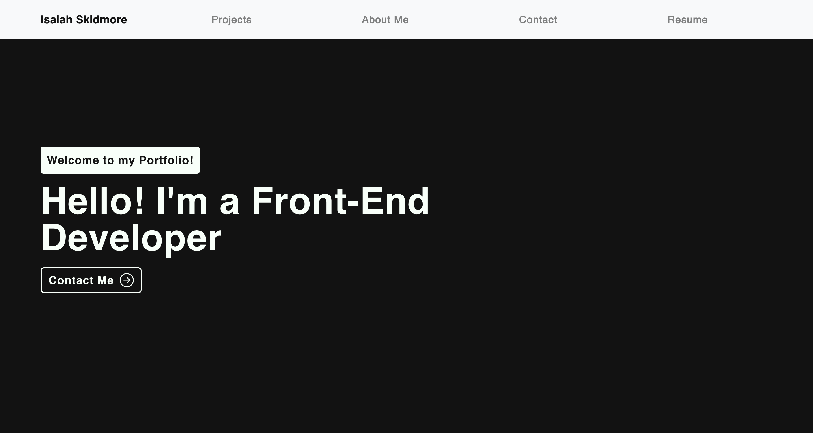

# Isaiah Skidmore's Portfolio 

Welcome to my personal portfolio website! This project showcases my work as a full stack developer, highlighting projects, skills, and experiences that reflect my journey in software development.

Website Link:

https://jolly-paletas-380445.netlify.app/

## Features

- **About Me**: A brief overview of who I am, my passion for coding, and my love for the outdoors.
- **Projects**: A collection of projects I've worked on, with links to the live versions or repositories.
- **Resume**: A list of technologies and tools that I am proficient in.
- **Contact**: A section where you can reach out to me via email or LinkedIn.  

  

  

## Technologies Used

- **HTML5**
- **CSS3**
- **JavaScript**
- **React**
- **Node.js**
- **Git & GitHub**

## Screenshot

  

## Future Improvements

- **Improving the overall styling and color scheme**
- **Implementing dark mode for the website**
- **Enhancing animations and transitions for a smoother user experience**
- **Adding a carousel for the skills i have as a software developer**

## License

This project is licensed under the MIT License 
